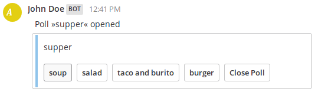

# Mattermost Poll

[](https://packagist.org/packages/pixelbrackets/mattermost-poll/)
[](https://gitlab.com/pixelbrackets/mattermost-poll/pipelines)
[](https://gitlab.com/pixelbrackets/mattermost-poll#requirements)
[](https://spdx.org/licenses/GPL-2.0-or-later.html)
[](https://about.mattermost.com/community-applications/)

Poll Slash Command for Mattermost.

`/poll supper soup salad "taco and burito" burger`



## Requirements

- PHP
- MySQL

The Mattermost instance calling this service has to be version 4.2 or greater
(provide »Interactive Message Buttons« feature).

## Installation

1. Clone project to desired directory
1. Run `composer install`
1. Edit `.env` file
1. Initialize database
   ```bash
   ./bin/console doctrine:database:create
   ./bin/console doctrine:migrations:migrate
   ```
1. Configure webserver to serve `web` directory
   - Development / Test: Run `php bin/console server:start 127.0.0.1:8000`
   - Production: [Configure webserver for Symfony Apps](https://symfony.com/doc/current/setup/web_server_configuration.html)
     and [export `.env` file](https://stackoverflow.com/questions/19331497/set-environment-variables-from-file/20909045#20909045)
1. Open homepage to see the »Request URL« needed for »Slash Commands«

### Integration into Mattermost

1. Add new »Slash Command« in each Teamspace in Mattermost
1. Use the »Request URL« shown on the homepage of the service

## Source

https://gitlab.com/pixelbrackets/mattermost-poll/

Mirror https://github.com/pixelbrackets/mattermost-poll/

## Demo

🚀 https://mattermost-poll.app.pixelbrackets.de/

## Usage

- Type the slash command, followed by the poll title, followed by all answers
- Separete the title and each answer with spaces
- use quotes to include spaces in a string

Create a poll with a title and four answers
```
/poll supper soup salad "taco and burito" burger
```

## License

GNU General Public License version 2 or later

The GNU General Public License can be found at http://www.gnu.org/copyleft/gpl.html.

## Author

Dan Untenzu (<mail@pixelbrackets.de> / [@pixelbrackets](https://github.com/pixelbrackets))

## Changelog

[./CHANGELOG.md](./CHANGELOG.md)

## Contribution

This script is Open Source, so please use, patch, extend or fork it.
